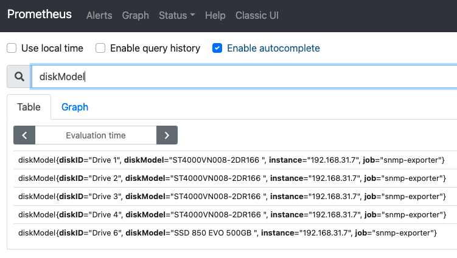
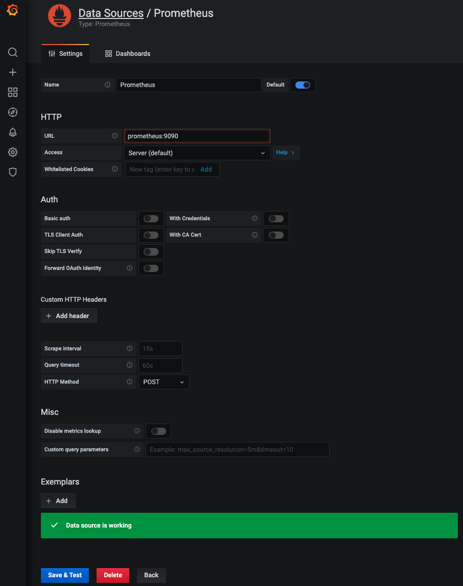

# 시놀로지 NAS 모니터링

이번 포스팅에서는 다들 하나씩 구비하고 있을 시놀로지 NAS를 자체적으로 모니터링하기 위한 방법중에 Prometheus를 활용해서 모니터링 하는 방법을 정리하고자 함이다.

## 구성방안

구성방법은 아래와 같다. 모든 구성요소는 시놀로지내 도커 컨테이너로 구성될 예정이다.


## Synology 모니터링

기본적으로 시놀로지 UI에서도 관련된 데이터들을 모두 확인할수 있고 디스크 오류나 전원 등 특별한 이벤트가 발생했을 경우는 별도로 이메일이나 커스텀 스크립트를 통해 알림을 받을 수 있지만 메트릭을 기반으로 하는 특정 상황에서 알림을 받거나 내가 원하는 모니터링 대시보드를 꾸미기 위한 용으로 시놀로지는 SNMP기반의 모니터링을 제공한다. 다른 NMP또는 모니터링 도구등을 사용하기 보다는 실제 SNMP exporter를 구성하고 프로메테우스와 연동을 통해 그라파나 대시보드를 통해 모니터링을 해보는데 목적이 있다.

## Synology 설정

### 사전 요구사항
- [시놀로지 Docker](https://www.synology.com/en-global/dsm/packages/Docker)
- SSH 허용
- Admin 권한
- SNMP 설정

위 3개가지 설명은 기본적으로 되어있다 가정하고 진행한다.  

시놀로지는 기본적으로 SNMP 설정이 비활성화 상태이기 때문에 변경이 필요하다. 아래 그림과 같이 시놀로지의 제어판 - 터미널 및 SNMP - SNMP탭 으로 이동해서 SNMP 서비스를 활성화를 체크하고 이후 snmp exporter 설정에서 사용될 community값을 원하는 값으로 변경한 후 저장한다.  


그럼 이제 시놀로지는 외부 통신을 위한 SNMP Port인 UDP 161 로 snmpd을 실행하게 된다. 

```sh
root@DSM2:~# netstat -unlp | grep 161
udp        0      0 0.0.0.0:161             0.0.0.0:*                           9437/snmpd
udp6       0      0 :::161                  :::*                                9437/snmpd
```

## SNMP Exporter

[https://github.com/prometheus/snmp_exporter](https://github.com/prometheus/snmp_exporter)

SNMP Exporter는 프로메테우스가 수집할 수 있는 형식으로 SNMP 메트릭 데이터를 Expose 할때 사용하는 방법으로 전통적인 모니터링 도구와 마찬가지로 MIB를 사용하게 된다. 레포지토리 컨셉에도 설명이 적혀있듯이 SNMP 데이터는 계층형 데이터 구조를 가지고 있고 프로메테우스는 다차원 매트릭스를 사용하고 있기 때문에 두 시스템은 잘 맞는다고 볼 수 있다.

SNMP 데이터 구조를 여기서 자세히 설명하지는 않겠지만  SNMP index와 label을 매핑하는 방식으로 데이터를 처리한다. 다른 익스포터와 동일하게 daemon 형태로 실행이 되고 `http://localhost:9116/snmp?module=if_mib&target=1.2.3.4` 와 같이 module과 target을 설정하는 방식으로 데이터 수집을 할 수 있다.

기본 config 파일을 `snmp.yml`을 참조하게 되는데 수동으로 작성하는 것이 아니라 generator를 통해 생성하게 된다.  
[https://github.com/prometheus/snmp_exporter/tree/main/generator](https://github.com/prometheus/snmp_exporter/tree/main/generator)

해당 링크에서 확인할 수 있듯이 generator에서 벤더별 MIB 파일과 generator.yml를 참조해서 빌드, 실행하고 결과값으로 snmp.yml이 생성되게 된다. 따로 만들어도 되지만 Synology에만 해당 파일을 바로 사용할 수 있도록 미리 만들어 두신 분이 계셔서 [그분](https://grafana.com/orgs/tumak)의 그라파나 대시보드를 참조하였다. 그리고 이후 시놀로지 대시보드로도 사용할 예정이다.  

[https://grafana.com/grafana/dashboards/14284](https://grafana.com/grafana/dashboards/14284)

만들어진 [snmp.yml]()에서 변경해야 할 부분은 현재 시놀로지에서 설정된 SNMP community 설정이다. snmp.yml 맨 아래 community 값을 시놀로지에 설정한 값과 일치하게 변경한다.  

```yaml
  auth:
    community: synology
```

## Prometheus, Alertmanager, Exporter, Grafana 구성

총 5개의 구성으로 모니터링 스택을 구성하려고 한다. 

- Prometheus : 데이터 수집 및 저장을 담당하는 시계열 데이터베이스
- Alertmanager : Prometheus에서 발생된 알림을 수신하여 메시지를 전달
- Node Exporter : Linux Node의 모니터링 데이터를 Expose
- SNMP Exporter : SNMP 기반 디바이스의 모니터링 데이터를 Expose
- Grafana : 시각화 도구

  

간단한 아키텍처 구성도로 시놀로지 자체 또는 OS기반에서 발생하는 모니터링 데이터를 수집하는 각각의 Exporter를 구성하고 해당 데이터를 수집하는 Prometheus 서버와 관련 데이터를 시각화하는 Grafana까지 한번에 구성하기 위해 Docker-compose를 사용할 예정이다.  

Docker Compose 파일을 맨 아래 snmp exporter 부터 하나씩 쪼개서 살펴보자.  

SNMP Exporter는 위에서 만든 snmp.yml 파일을 마운트해서 실행되도록 한다. 그러면 SNMP exporter가 실행되면서 snmp파일을 참조해서 실행이 되고 prometheus.yaml에서 정의한 target과 SNMP 프로토콜을 통해 관련된 메트릭 값을 수집해서 Expose하게 될 것이다.  

```yaml
  snmp-exporter:
    image: prom/snmp-exporter
    container_name: snmp_exporter
    volumes:
      - ./snmp_exporter/:/etc/snmp_exporter/
    ports:
      - 9116:9116
    volumes:
      - ./snmp-synology/snmp.yml:/etc/snmp_exporter/snmp.yml
    command:
      - "--config.file=/etc/snmp_exporter/snmp.yml"
```

다음은 Node Exporter를 실행하는 부분으로 시스템에 관련된 권한이 필요하므로 `/proc, /sys, /` 등 파일시스템의 read only 권한과 `privileged: true` 설정을 통해 실행되게 될 것이다.

```yaml
  node-exporter:
    privileged: true
    image: prom/node-exporter
    container_name: node-exporter
    restart: always
    ports:
      - "9100:9100"
    volumes:
      - /proc:/host/proc:ro
      - /sys:/host/sys:ro
      - /:/rootfs:ro
    command:
      - "--path.procfs=/host/proc"
      - "--path.sysfs=/host/sys"
      - "--collector.filesystem.ignored-mount-points"
      - "^/(rootfs/)?(dev|etc|host|proc|run|sys|volume1)($$|/)"
```

다음은 시각화와 알림을 담당할 Grafana와 Alertmanager 부분으로 Alertmanager의 경우 기본적인 config를 마운트해서 실행을 할 예정이다.

```yaml
  grafana:
    container_name: grafana
    image: grafana/grafana
    ports:
      - "3000:3000"
    depends_on:
      - prometheus

  alertmanager:
    container_name: alertmanager
    image: prom/alertmanager:v0.21.0
    ports:
      - 9093:9093
    volumes:
      - ./config/alertmanager.yml:/etc/alertmanager/alertmanager.yml
    restart: always
```

마지막으로, Prometheus는 알림룰을 생성하기 위해서 별도로 rules 디렉토리와 미리 생성해둔 config를 mount 시킨다.  

```yaml
version: "3.8"
services:
  prometheus:
    container_name: prometheus
    image: quay.io/prometheus/prometheus:v2.26.0
    volumes:
      - ./config/prometheus.yml:/etc/prometheus/prometheus.yml
      - ./rules:/etc/prometheus/rules
    command: "--config.file=/etc/prometheus/prometheus.yml --storage.tsdb.path=/prometheus"
    ports:
      - 9090:9090
```

prometheus.yml config를 살펴보면 수집주기는 1분으로, 나머지 얼럿매니저와 수집할 대상인 exporter들의 target endpoint를 추가하여 실행할 예정이다. 여기서는 시놀로지 SNMP 서비스와 통신하기 위해 SNMP Exporter의 target을 실제 사용중인 시놀로지 IP를 등록하도록 한다.  

```yaml
global:
  scrape_interval:     1m
  evaluation_interval: 1m

alerting:
  alertmanagers:
  - static_configs:
    - targets: ['alertmanager:9093']

rule_files:
  - "/etc/prometheus/rules/*"

scrape_configs:
  - job_name: 'prometheus'
    static_configs:
      - targets: ['localhost:9090']
        labels:
          group: 'prometheus'
  - job_name: node
    static_configs:
    - targets: ['node-exporter:9100']
  - job_name: 'snmp-exporter'
    static_configs:
    - targets: ['192.168.31.7']
    metrics_path: /snmp
    params:
      module: [synology]
    relabel_configs:
      - source_labels: [__address__]
        target_label: __param_target
      - source_labels: [__param_target]
        target_label: instance
      - target_label: __address__
        replacement: 192.168.31.7:9116  # The SNMP exporter's real hostname:port. 
```

## Stack 실행

모든 설정이 완료되면 일단 기본적인 실행이 가능한 상태로 시놀로지 CLI를 실행한다. 기본적으로 시놀로지는 admin계정으로 로그인해서 sudo 권한을 통해 Docker Compose 실행을 해야 한다.  

```sh
ssh admin@192.168.31.7
sudo -i
```

[https://github.com/ddiiwoong/synology-prometheus.git](https://github.com/ddiiwoong/synology-prometheus.git)을 clone해서 /snmp-synology/snmp.yml 파일의 community 값을 본인의 synology 값으로 변경한 후 Docker Compose를 데몬형태로 실행한다.  

```sh
docker-compose up -d
```

본인의 `http://<시놀로지 IP>:9090/targets` 으로 접속해서 3개의 target이 정상인지 확인한다. 그리고 표현식 브라우저로 돌아와서 `node_cpu_seconds_total` 과 `diskModel`을 통해 두개의 exporter에서 데이터가 수집되고 있는지 확인할 수 있다. `diskModel`은 시놀로지에 장착된 하드디스크 모델 정보를 보여주는 메트릭이다.  



그라파나 대시보드는 `http://<시놀로지 IP>:3000` 로 접속해서 초기 계정인 `admin:admin`을 입력하면 다음과 같이 기본 화면을 볼수 있다. 여기서 좌측의 기어모양 메뉴(Configuration)의 `Data Sources`를 클릭하고 프로메테우스 데이터소스를 등록한다.  

Docker Compose로 실행할 때 아래와 같이 `prometheus` 이름으로 실행했기 때문에 HTTP URL에 `prometheus:9090`을 입력하고 `Save & Test`로 데이터 소스를 저장한다.  



## 시놀로지 대시보드 구성

마지막으로 [https://grafana.com/grafana/dashboards/14284](https://grafana.com/grafana/dashboards/14284)의 대시보드를 추가하는 과정을 진행한다.  

좌측의 + 메뉴(Create)의 `Import`를 클릭하고 위 대시보드 ID `14284`를 입력하고 등록하면 아래와 같이 시놀로지의 모니터링 대시보드를 확인할 수 있다. 


## 정리

간단(?)하게 시놀로지 나스를 모니터링하는 방법에 대해서 정리해봤다. 누군가에게는 재미로 누군가에게는 도움이 되길 바라며, 포스팅과 관련된 모든것은 개인 취미로 작성된 내용으로 회사나 나스와 관련된 제품과 관계가 없음을 다시한번 알린다.  
