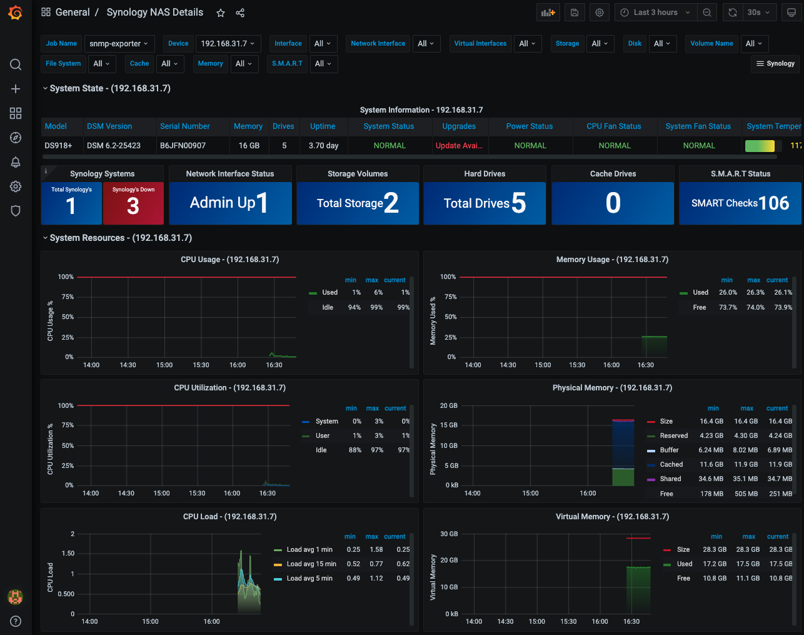
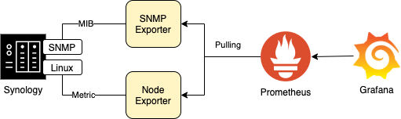

## Synology with Prometheus

Monitoring Synology NAS with snmp_exporter and prometheus




## Dependency
- [Synology Docker](https://www.synology.com/en-global/dsm/packages/Docker)
- Enabled SSH
- Administartor Access
- Enabled SNMP

## Architecture

  

## Synology IP

In order to communicate with the synology SNMP service, the target of SNMP Exporter is required to register the Synology IP that is actually in use.

```yaml
scrape_configs:
  - job_name: 'prometheus'
    static_configs:
      - targets: ['localhost:9090']
        labels:
          group: 'prometheus'
  - job_name: node
    static_configs:
    - targets: ['node-exporter:9100']
  - job_name: 'snmp-exporter'
    static_configs:
    - targets: ['<Synology IP>']
    metrics_path: /snmp
    params:
      module: [synology]
    relabel_configs:
      - source_labels: [__address__]
        target_label: __param_target
      - source_labels: [__param_target]
        target_label: instance
      - target_label: __address__
        replacement: <Synology IP>:9116  # The SNMP exporter's real hostname:port. 
```

## Install

```
docker-compose up
```

## Configure

## Reference

[https://grafana.com/grafana/dashboards/14284](https://grafana.com/grafana/dashboards/14284)
